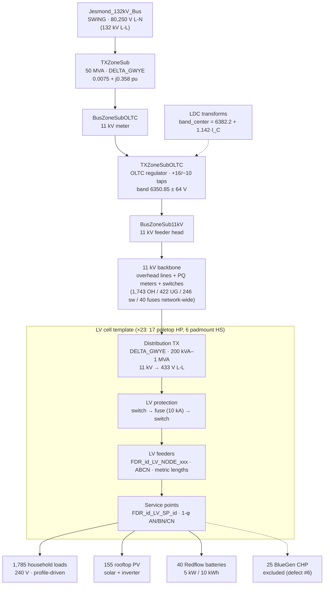

# Anatomy of the Elermore Vale feeder model — 132 kV bus to LV service point

A top-to-bottom map of the GridLAB-D model in [`glm/`](glm/) and what it
becomes after the runtime translation in
[`elermorevale_openDSS.py`](elermorevale_openDSS.py). Written as layered
boxes-and-edges so it can be turned into a diagram: each **Layer** is a
vertical band, each bulleted element is a node, each `A → B` is an edge.
Counts and impedances are the measured ground truth pinned in
[`MODEL_VERIFICATION.md`](MODEL_VERIFICATION.md).

## Voltage cascade (the diagram's spine)

```
132 kV L-L (sub-transmission, Jesmond)
  └─ 50 MVA zone transformer + OLTC regulator
       └─ 11 kV L-L backbone (Elermore Vale streets)
            └─ 23 × distribution transformers (200 kVA – 1 MVA)
                 └─ 415 V L-L / 240 V L-N LV feeders
                      └─ 1,785 single-phase household loads (+ PV, batteries)
```

## Layer 0 — Source: `Jesmond_132kV_Bus`

Defined in [`glm/Elermorevale/elermorevaleZone132kV.glm`](glm/Elermorevale/elermorevaleZone132kV.glm).

| Property | Value |
|---|---|
| Object | `meter`, 3-phase ABC, `bustype SWING` (slack bus) |
| Pinned voltage | 80,250 V L-N per phase — **≈ 5.3 % above** the zone TX's rated primary of 76,210 V L-N (= 132 kV L-L ÷ √3); the model author pinned the real operating setpoint, not nameplate |
| OpenDSS translation | `New Circuit.Elermorevale basekv=132 pu=1.0` with near-zero impedance (`R1=1e-5 X1=1e-4`) — an **ideal source**, matching GridLAB-D's zero-impedance SWING; even a stiff 20 kA source left a uniform 0.024 % network-wide error in validation |

## Layer 1 — Jesmond zone substation (four series elements + one control loop)

Series chain (all in `elermorevaleZone132kV.glm`):

```
Jesmond_132kV_Bus → TXZoneSub → BusZoneSubOLTC → TXZoneSubOLTC → BusZoneSub11kV
    (SWING)         (50 MVA TX)   (11 kV meter)    (OLTC reg.)     (feeder head)
```

- **`TXZoneSub`** — power transformer: 50 MVA, DELTA_GWYE, VAULT install,
  impedance 0.0075 + j0.3580 pu. Config voltages are stated **line-to-neutral**:
  76,210.24 V → 6,350.85 V (i.e. 132 kV → 11 kV L-L).
- **`BusZoneSubOLTC`** — intermediate 11 kV meter between TX and tap changer.
- **`TXZoneSubOLTC`** — the on-load tap changer as a separate WYE_WYE
  `regulator`: +16 / −10 taps, ±20 % regulation range, band centre 6,350.85 V,
  band width 128 V, `OUTPUT_VOLTAGE` control, 3 s time delay.
- **`BusZoneSub11kV`** — the 11 kV busbar; head of the distribution feeder.
- **LDC control loop** (dashed arrows in a diagram): a `lookup_table`
  (`current_sign`, sign of measured power) feeds an `aggregate_transform`
  (`LDC`) that rewrites the regulator's band centre each timestep as
  `band_center = 6382.202 + 1.14229 × I_C × sign(P)` — line-drop compensation,
  targeting a higher voltage when the feeder is heavily loaded.

**Translation notes.** GridLAB-D refers pu impedance to *V_secondary² as
written*; the zone config states L-N voltages, so the impedance base is one
third of the 11 kV L-L base and OpenDSS gets `xhl = 35.8/3 = 11.93 %`. The
OLTC becomes a `RegControl` only under `--oltc` (default `controlmode=off`).
Documented negative result: **the OLTC never moves on real profiles** — the
11 kV bus stays within ±0.5 %.

## Layer 2 — 11 kV backbone ([`glm/Elermorevale/elermorevale11kV.glm`](glm/Elermorevale/elermorevale11kV.glm))

Repeating pattern radiating from `BusZoneSub11kV`:

```
meter (PQ, 6350.85 V L-N) → overhead_line (3-ph) → meter → switch (BANKED, CLOSED) → meter → …
```

- Nodes are PQ `meter`s named after Ausgrid plant IDs (`_10053D80784J`,
  `_10052E`, …).
- Sectionalizing `switch`es (`HC…GSW…`) are interleaved for
  reconfiguration/protection; all CLOSED in the base case.
- Line configs (`Elermore_line_config_N`) resolve against
  [`glm/common/Line Configs.glm`](glm/common/): 3,834 configurations,
  395 conductors (1,136 with explicit z-matrices); the 82 configs actually
  referenced all resolve, 0 fallbacks.
- **Gotcha:** bare backbone lengths (`length 1.00`) are **feet**, not metres
  (`glm_length_m()` handles this); LV lengths carry explicit `m` units.
- z-matrix configs reduce to balanced sequence impedances
  `z1 = z11 − z12`, `z0 = z11 + 2·z12`; conductor-reference configs get
  per-(config, phase-set) modified-Carson matrices from
  [`line_impedance.py`](line_impedance.py) (50 Hz, 100 Ω·m).

Network-wide line/switchgear totals: **1,743 overhead + 422 underground
lines, 246 switches, 40 fuses**.

## Layer 3 — 23 distribution substations ([`glm/Elermorevale/subs/*.glm`](glm/Elermorevale/subs/))

One file per transformer and its complete LV cell:
**17 `HP…GTX…` (POLETOP)** and **6 `HS…GTX…` (PADMOUNT/kiosk)**.
Ratings: 6 × 200 kVA, 7 × 300, 4 × 315, 3 × 400, 2 × 600, 1 × 1000 kVA
([`glm/Elermorevale/TransformerConfigs.glm`](glm/Elermorevale/TransformerConfigs.glm),
which also carries thermal-aging data — oil volume, hot-spot rise,
insulation life — unused by the power flow).

**LV cell template** (draw once in detail; the other 22 collapse to a box).
Example instance: `HP00001431GTX00000001.glm` — 76 loads, 11 PV systems,
90 OH + 2 UG lines, 5 switches, 1 fuse:

```
<11 kV backbone node>
  → <sub>_TX            transformer, DELTA_GWYE, e.g. 300 kVA, 10,725 → 433 V L-L
                        (r 0.012, x 0.039 pu; L-L secondary, so GridLAB-D and
                        OpenDSS impedance conventions coincide here)
  → <sub>_LV            meter, 240 V L-N nominal, ABCN
  → switch → meter
  → <sub>LDI…           fuse, ABCN, 10 kA current limit
  → meter → switch
  → FDR_<id>_LV_NODE_xxx   LV feeder head
  → overhead_line (ABCN, 4-wire, metric lengths e.g. 46.0 m) → FDR_…_LV_NODE_yyy → …
      → overhead_line (single-phase drop, e.g. phases BN, 31.1 m)
          → FDR_<id>_LV_SP_<id>    service point (one per premise)
              ├─ load LOAD_<nmi>   single-phase AN/BN/CN, 240 V
              │                    base_power ← Load_<id>.result (runtime
              │                    temperature-dependent load synthesis via
              │                    load_coeffs/ + LoadTempTransform.glm)
              └─ solar + inverter  rooftop PV pair (155 pairs network-wide)
```

## Layer 4 — DER overlay ([`glm/Elermorevale/generators/Generators2.glm`](glm/Elermorevale/generators/))

Drawn as attachments to LV service points, not part of the tree:

- **40 × Redflow ZBM `battery`** — 5 kW / 10 kWh, CONSTANT_PQ,
  86 % efficiency, 180 W parasitic draw, parented on `FDR_…_LV_SP_…` nodes.
  Controlled by 520 `aggregate_transform` + 200 `lookup_table` runtime
  objects. Translated as OpenDSS **`Generator`s, not `Storage`**
  (Storage collapses the engine — defect #1).
- **25 × BlueGen CHP** modelled as `load` objects — **excluded from the
  build** (`is_chp_load`, defect #6): a phase mismatch leaves 14 floating
  at 0 V if energised.
- `Generators.glm` only declares `module generators;`.

## Assembly glue — [`glm/Elermorevale/main.glm`](glm/Elermorevale/main.glm) + [`glm/common/`](glm/common/)

Include order: clock (2012 window, `PST+8PDT` timezone oddity) → interval
dump (1800 s) → climate → powerflow/reliability/tape/residential modules →
four custom runtime classes (`aggregate_transform`, `lookup_table`,
`calculus`, `time_delay` — used by the LDC and load synthesis) → constants,
tariff schedules, line configs → load-coefficient files + LoadTempTransform
→ zone file → backbone → transformer configs → 23 subs → generators →
players → recorders.

## What OpenDSS ends up with (translation census)

Pinned by `tests/test_translation_invariants.py`; re-derive if the GLM is
ever regenerated.

| Stage | GLM source | DSS engine |
|---|---|---|
| Source | 1 SWING meter (80,250 V L-N) | ideal Vsource, 132 kV base, pu = 1.0 |
| Transformers | 24 (1 zone + 23 distribution) | 25 (zone TX + OLTC element + 23 dist.) |
| Lines | 1,743 OH + 422 UG (+ 246 switches, 40 fuses) | 2,451 Lines |
| Loads | 1,810 (1,785 homes + 25 excluded CHP) | 1,785 Loads |
| DER | 155 solar/inverter + 40 batteries | 195 Generators, 0 Storage |
| Control | OLTC regulator + LDC transforms | 1 RegControl (only with `--oltc`) |
| Topology | 7,958 GLM objects total | 4,597 node-phases, all energised |

Every load is created at a placeholder 3 kW / 0.95 pf; real half-hourly kW
enter via LoadShapes in profile mode (~152 valid Ausgrid customers cycled
over the 1,785 loads; unmapped loads zeroed). Per-unit reporting base is
240 V (`V_NOM`), AS 60038 limits +10 % / −6 %. Golden snapshot solve:
source 1,849.4 kW, losses 64.4 kW, V min/mean/max 0.862 / 0.960 / 1.011 pu.
Validation vs GridLAB-D: exact at 132 kV and 11 kV to solver tolerance,
≤ 0.02 % at LV (post the 2026-08-24 Carson impedance rework).

## Starter diagram (Mermaid)



### Diagram suggestions

- **Lanes** = voltage levels: 132 kV / 11 kV / 415–240 V. Solid edges =
  power path; dashed = control (LDC) and excluded elements (CHP).
- Detail **one** LV cell; collapse the other 22 into a stacked-box glyph
  annotated "×22".
- Annotate the two convention traps on their elements: feet-vs-metres on
  backbone lines, L-N impedance referral (`xhl = 11.93 %`) on the zone TX.
